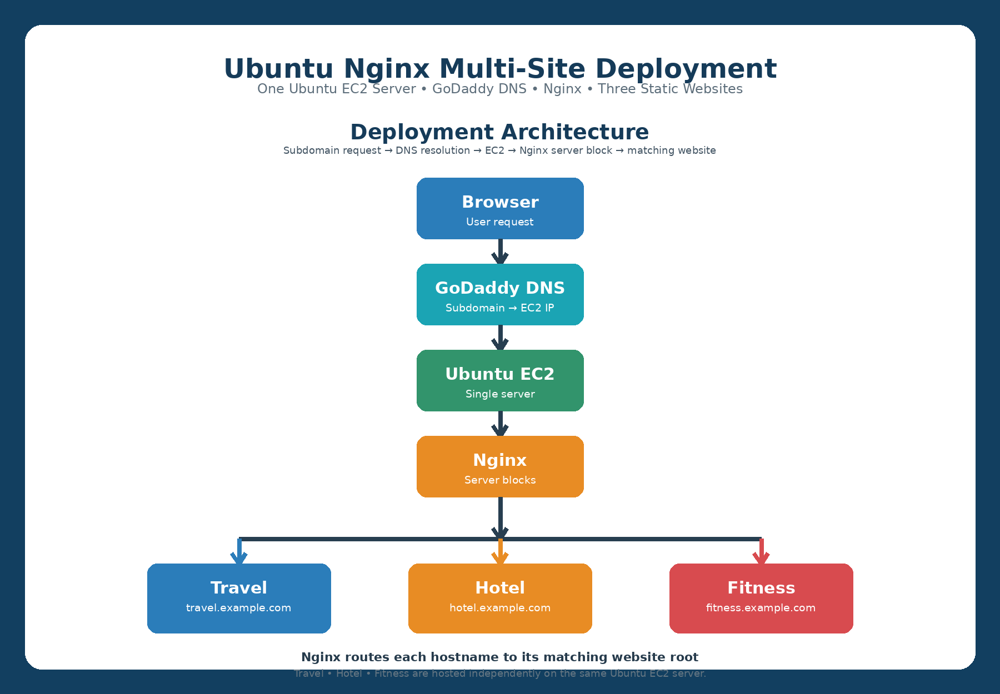

# Ubuntu Nginx Multi-Site Deployment

> **Project:** Host three independent static websites on a single Ubuntu EC2 server using Nginx server blocks and GoDaddy DNS.

## 🏗️ Architecture



**Flow:** Browser → GoDaddy DNS → Ubuntu EC2 → Nginx → Travel / Hotel / Fitness

## 📌 Project Overview

This project demonstrates how to host three separate static websites on one Ubuntu EC2 server using Nginx.

- ✈️ Travel Website
- 🏨 Hotel Website
- 💪 Fitness Website
- 🌐 GoDaddy subdomains for website access
- ⚙️ Nginx server blocks for separate routing
- 🐧 Ubuntu Linux on AWS EC2

## 🛠️ Technologies Used

- AWS EC2
- Ubuntu Linux
- Nginx
- GoDaddy DNS
- Shell Scripting
- HTML
- Git / GitHub

## 📁 Website Structure

```text
/var/www/html/
├── travel/
│   └── travel.html
├── hotel/
│   └── hotel.html
└── fitness/
    └── fitness.html
```

## ⚙️ Nginx Configuration

```text
/etc/nginx/sites-enabled/
├── travel.conf
├── hotel.conf
└── fitness.conf
```

Each website uses its own Nginx server block and website root.

## 🌐 GoDaddy DNS

Example subdomains:

```text
travel.premrrr.site
hotel.premrrr.site
fitness.premrrr.site
```

GoDaddy DNS connects the subdomains to the EC2 server, and Nginx selects the correct website.

## 🔄 Request Flow

1. User enters a website subdomain.
2. GoDaddy DNS resolves the subdomain.
3. The request reaches Ubuntu EC2.
4. Nginx receives the request.
5. Nginx checks the hostname.
6. The matching server block is selected.
7. Nginx serves the correct static website.

---

# 📸 Project Screenshots

Below are the screenshots in the exact project sequence.

## Step 1 — EC2 Instance Details


## Step 2 — EC2 Instance Running State


## Step 3 — SSH Login and PWD


## Step 4 — Create and Run Shell Scripting File


## Step 5 — Check Files Created by Shell Script


## Step 6 — Shell Script Successfully Completed


## Step 7 — Add Server IP in GoDaddy


## Step 8 — Add Website Subdomains


## Step 9 — Create and Configure Nginx Server Block Files


## Step 10 — Travel Website Output


## Step 11 — Hotel Website Output


## Step 12 — HTTPS Website Not Opening


## Step 13 — HTTP Added and Fitness Website Output


## Step 14 — Server Blocks Reference


---

## 🎯 Final Result

```text
                    Ubuntu EC2
                        │
                      Nginx
             ┌──────────┼──────────┐
             ↓          ↓          ↓
          Travel      Hotel      Fitness
         Website     Website     Website
```

All three static websites run independently from a single Ubuntu EC2 server.

## 👨‍💻 Project Learning

- EC2 deployment
- Ubuntu Linux administration
- Nginx installation and configuration
- Nginx server blocks
- Static website hosting
- Website directory structure
- GoDaddy DNS and subdomains
- Shell scripting basics
- Git and GitHub project documentation
- Basic web troubleshooting